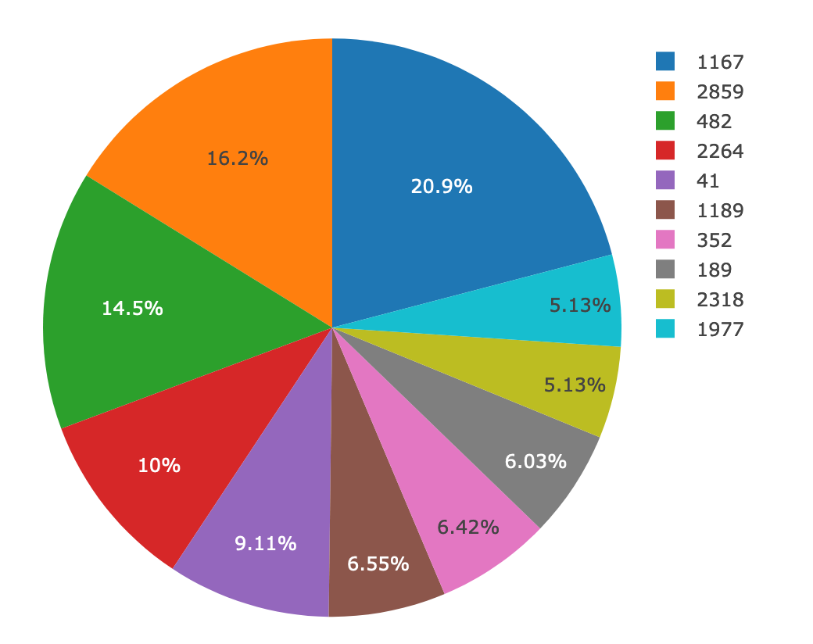

# Belly Button Biodiversity

For this project I buit an interactive dashboard to explore the [Belly Button Biodiversity DataSet](http://robdunnlab.com/projects/belly-button-biodiversity/).

## Step 1 - Plotly.js

I used Plotly.js to build the following interactive charts:

* A pie chart that uses data from the samples route (`/samples/<sample>`) to display the top 10 samples.

  

* A bubble chart that uses data from your samples route (`/samples/<sample>`) to display each sample.

  

## Step 2 - Heroku

I used Heroku to deploy the flask app.

- - -

